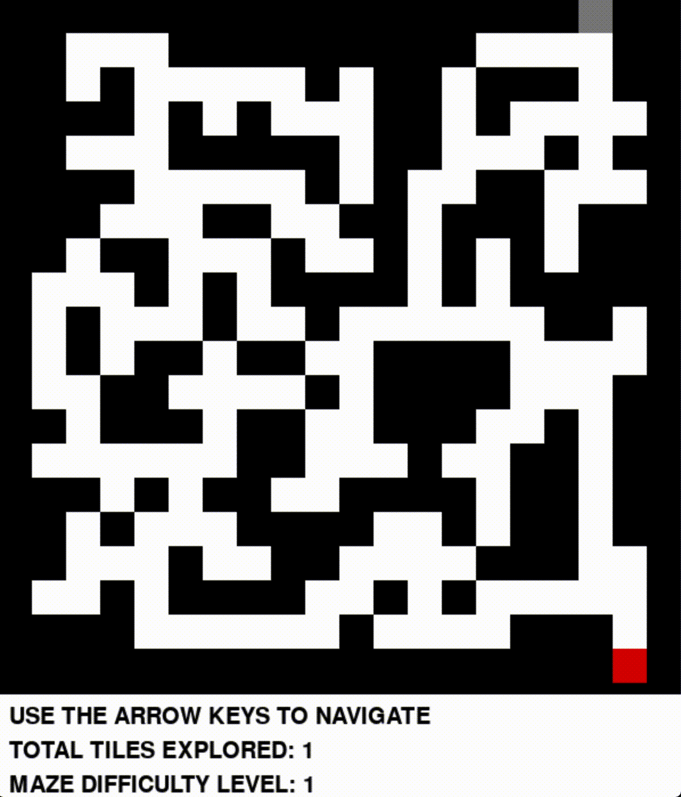

# Maze Escape

Welcome to Maze Escape!

I created an interactive game for maze escape problems. The game increases in difficulty as the level number increases. Here are some examples of what the first three levels might look like:

I also implemented automatic solvers, which can be invoked by pressing "a" at any point. The solvers can be found in `solvers.py`. The current implementations are simple `DFS` and `BFS` algorithms. `DFS` tends to give non-optimal paths, and fails to find a solution in a reasonable amount of time after level ~10. For these reasons, the `BFS` algorithm is preferred. 

As it turns out, dynamically creating unique and *interesting* mazes is a substantially harder problem than solving them!  I implemented a couple of different algorithms for maze generations, which are found in `maze_generators.py`.  Both algorithms use disjoint sets to ensure a solution exists. I found that the second algorithm, which starts with a blank maze and iteratively adds walls without creating disjoint sets, makes much more interesting mazes. More details can be found in the code. Some of the mazes it can produce are listed below.

Here is what a level 7 maze might look like:

Here is what a level 12 maze might look like:

Here is what a level 12 maze might look like:

Here is what a level 15 maze might look like:

