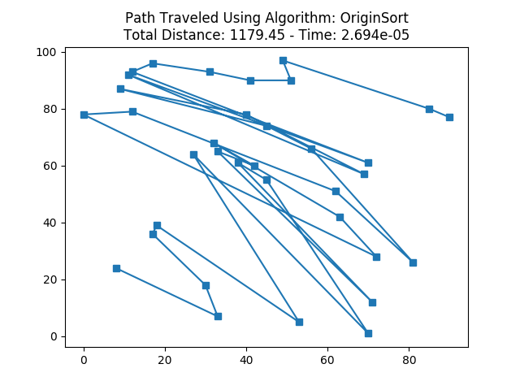
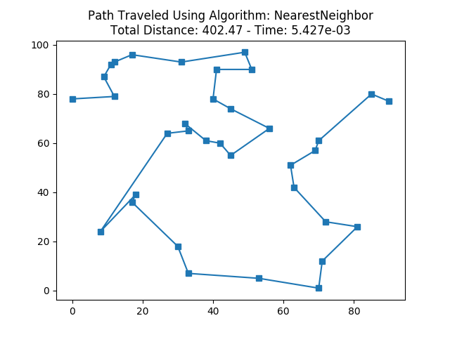
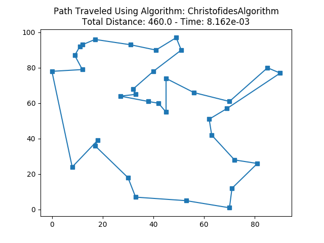
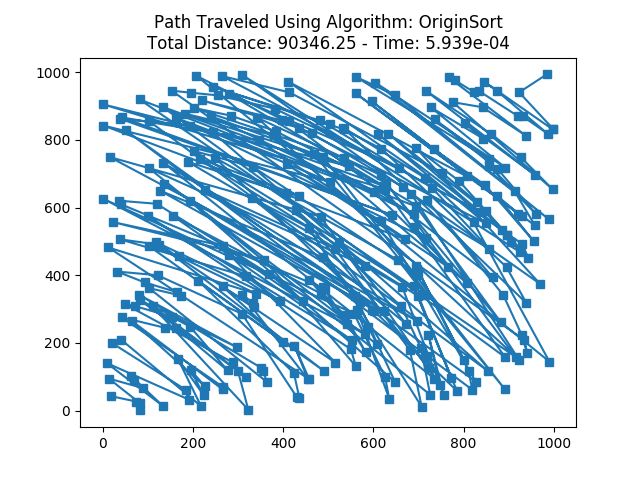
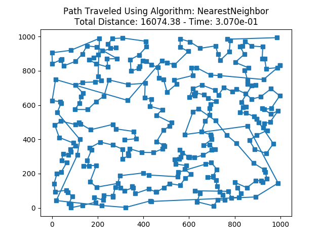
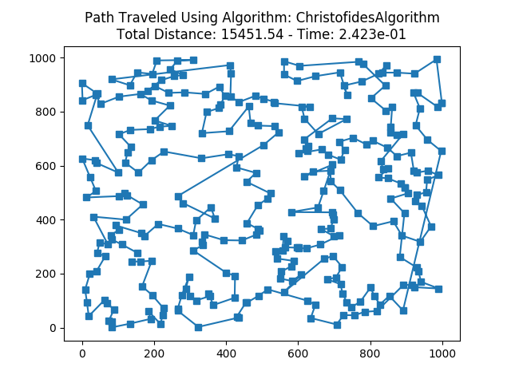
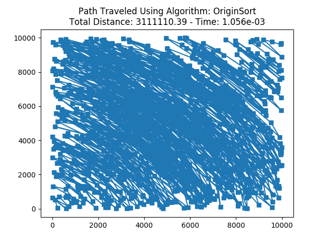
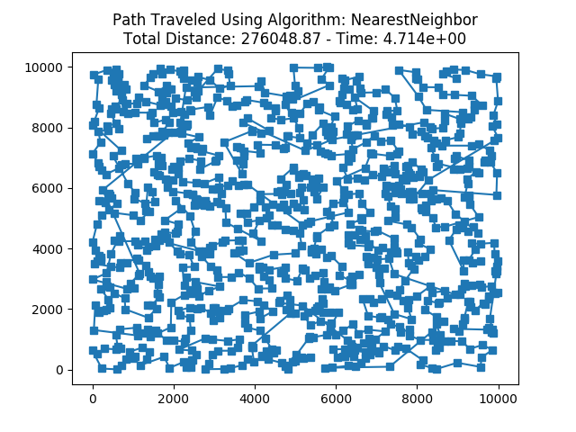
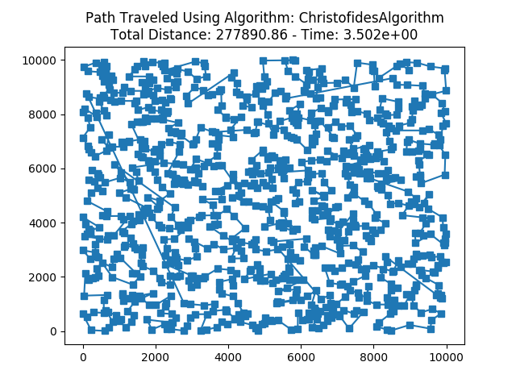

# Traveling Salesman Problem (TSP)

This directory contains a testing framework and various solutions to the traveling salesman problem.  The testing sandbox is contained in `tester.py` and TSP solutions are contained in `solvers.py`.  `tester.py` contains several test sets, which are data sets generated using the parameters `n`, `m`, and `n_points`, where `n` and `m` denote the size of the grid and `n_points` denotes the number of nodes our salesman must visit. The driver within `tester.py` allows one to easily swap out different test sets and/or algorithms. The following solutions are currently implemented in `solvers.py`:

        Exact Solvers:
            - BruteForceSolver (all permuations)
            - HeldKarpSolver (all perm. + dynamic programming)
            - BBSolver (branch and bounds / dfs + pruning)

        Basic (highly approximate) Solvers:
            - HorizontalSortSolver
            - VerticalSortSolver
            - OriginSortSolver
            - RandomSampleSolver

        Greedy Solvers:
            - NearestNeighborSolver
            - NearestNeighborSolverParallel
            - ChristofidesAlgorithmSolver

Below are some solutions to TSP for different test sets. 

For each test set, I list the results of three different solvers: "OriginSortSolver", "NearestNeighborSolver", and "ChristofidesAlgorithmSolver".  Each of these are approximation algorithms for TSP. I also implemented some exact solutions, but these kernels do not scale up to any interesting problems. 

The results are separated by the number of (cities, points, nodes, etc.) in the problem.

## N_cities = 50

## N_cities = 300

## N_cities = 1000

In these examples, it is clear the origin sort algorithm is the worst of the three. The Nearest Neighbor and Christofides algorithms are very comparable in both quality of solutions and computation times. Although I would consider these two algorithms incomparable in level of implementation difficulty (Christofides was much, much harder xD).
